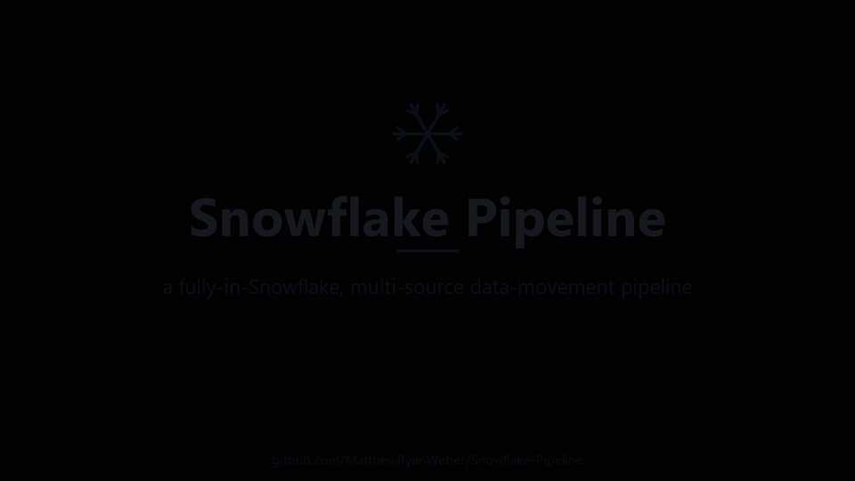
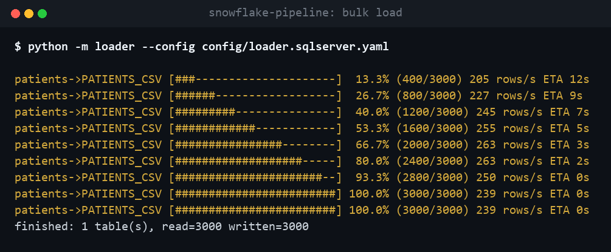
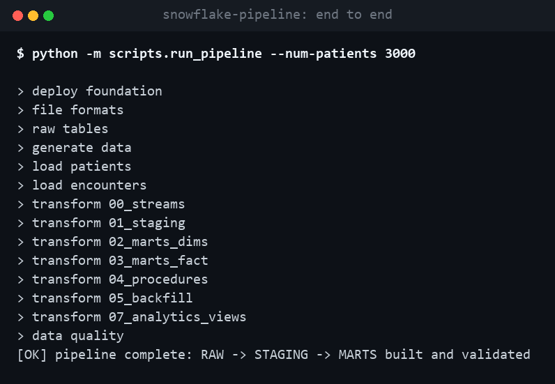

# Snowflake Pipeline

A **fully-in-Snowflake, multi-source data-movement pipeline**. It **moves data**
from many source systems (SQL Server, PostgreSQL, MySQL, Oracle, SQLite, REST APIs, Excel,
Parquet, CSV, S3) into Snowflake, then does **everything else natively inside Snowflake**:
transform, orchestration, and audit. The only external component is the connector that extracts
rows from a source (Snowflake cannot reach an on-prem/local DB directly — true of any Snowflake
pipeline).

- **Move:** 9 pluggable sources behind one incremental, checkpointed contract — switching source
  is a config change, not a code change.
- **Transform in Snowflake:** stored procedures on a Streams + Tasks DAG, plus declarative
  **Dynamic Tables** (Snowflake-maintained, no external orchestration).
- **Structure:** `RAW → STAGING → MARTS` — landing to a cleansed, typed star schema (fact + dims).
- **Audit in Snowflake:** every transfer is logged to `GOV.LOAD_LOG` (plus native `COPY_HISTORY`
  / `ACCESS_HISTORY`).

**The app moves and structures data — it does not compute analytics.** Aggregation and reporting
are left to the BI/query layer on top of the model.

**Standalone / CLI only — no web interface.** Verified live against real Snowflake + source DBs.

> Data is fully synthetic — no real records. The pipeline also wires up Snowflake's native PII
> masking and role-based access as part of the load (see below), enforced as if it were prod data.

## Verified live

Every layer below was **run against real infrastructure**, not just unit-tested:

- **End-to-end on a real Snowflake account** — the full native stack (setup → ingest → transform)
  deploys and runs; the star schema builds from loaded data.
- **9 pluggable sources** — the same incremental (high-water-mark) contract across SQL Server,
  PostgreSQL, MySQL, Oracle, SQLite, REST APIs, Excel, Parquet, and CSV. SQL Server, Postgres and
  MySQL verified live (Postgres/MySQL against Docker containers); REST/Excel/Parquet covered by
  the test suite. See [`docs/sources.md`](docs/sources.md).
- **Incremental + safe to re-run** — loads filter on a high-water-mark and checkpoint per batch;
  a crash resumes from the last committed row, and re-running never duplicates.
- **Native PII masking** — the same SSN returns `XXX-XX-2073` to `PIPELINE_ROLE` and `718-70-2073`
  to `PII_READER`, enforced by a Snowflake masking policy at query time (not by the app).
- **Transfer audit** — every load is written to `GOV.LOAD_LOG` (source, target, rows, user, time).
- **Data quality** — 16/16 referential-integrity + masking checks pass on the loaded model.
- **Scale features** — parallel table loads (2 at once) and metadata-driven ingestion (an `INSERT`
  into `GOV.SOURCES` made the next run pick up a second table), exercised live.
- **Managed service** — the CI/CD workflow (`deploy.yml`) provisions a fresh `HEALTH_ANALYTICS_DEV`
  database from GitHub Actions (green run), and the loader runs from a built Docker image.

Only S3 Snowpipe *auto-ingest* is unverified (needs an AWS bucket + IAM); its COPY/VARIANT half
is verified via an internal stage.

## Demo

[](docs/videos/snowflake-pipeline-sizzle.mp4)

*15-second narrated overview. The preview above is silent; click for the 1080p [video with sound](docs/videos/snowflake-pipeline-sizzle.mp4).*

## Native Snowflake objects

The transformation and orchestration run **inside Snowflake** (not just an external connector).
Objects created:

| Object | Where | Purpose |
|---|---|---|
| **Tables** | `RAW` / `STAGING` / `MARTS` | landing → cleansed → star schema (fact + dims) |
| **Views** | `STAGING.v_*` | canonical flatten/dedup; call the masking UDFs |
| **Stored Procedures** | `STAGING.sp_ingest`, `sp_build_marts` | the transform logic |
| **Streams** | `RAW.str_patients`, `str_encounters` | change data capture (incremental) |
| **Tasks** | `t_ingest → t_build_marts` | scheduled, stream-gated DAG |
| **Snowpipe** | `RAW.patients_pipe`, `encounters_pipe` | file auto-ingest (S3 event → SQS) |
| **UDFs** | `STAGING.mask_ssn`, `mask_phone` | in-warehouse PII masking |
| **Masking Policies** | `GOV.mask_ssn`, `mask_phone`, `mask_tagged` | Dynamic Data Masking, role-based |
| **Dynamic Tables** | `STAGING.dt_*` | declarative, Snowflake-maintained transform |
| **Tags** | `GOV.pii` | tag a column → auto-masked (scales masking by tagging) |
| **Resource Monitor** | `PIPELINE_RM` | credit quota: notify + suspend before overspend |
| **Alerts** | `GOV.task_failure_alert` | fires on Task failures → `GOV.alert_log` |
| **Control table** | `GOV.SOURCES` | metadata-driven work-list — add a table = add a row |

## Sources

Nine sources, one contract (`connect / count / fetch_batches / close`), all incremental and
checkpointed. Full matrix and the live-Docker repro steps: [`docs/sources.md`](docs/sources.md).

| `source.type` | Backend | Driver | Verified |
|---|---|---|---|
| `sqlserver` | SQL Server | pyodbc | live |
| `postgres` | PostgreSQL | psycopg2 | live (Docker) |
| `mysql` | MySQL / MariaDB | PyMySQL | live (Docker) |
| `oracle` | Oracle | oracledb | wired, unit-tested |
| `sqlite` | SQLite | stdlib | live |
| `rest` | REST API (JSON) | requests | test suite |
| `excel` | Excel `.xlsx` | openpyxl | test suite |
| `parquet` | Parquet file | pyarrow | test suite |
| `file` | CSV | stdlib | live |

```bash
python -m loader --config config/loader.postgres.yaml     # --dry-run to preview
```

## Checkpointing & resume

Imports are checkpointed per batch and resume automatically. After every committed batch the
loader records that table's checkpoint to `state/watermarks.json`: the high-water-mark reached
(the resume cursor), rows loaded so far, and a status. A crash at row 10,000 of 11,000 resumes
from 10,001 on the next run, never reloading committed rows and never skipping uncommitted ones.

```bash
python -m loader --config config/loader.postgres.yaml           # resumes from the last checkpoint
python -m loader --config config/loader.postgres.yaml --status   # show per-table checkpoint, no load
python -m loader --config config/loader.postgres.yaml --restart  # ignore checkpoint, reload from scratch
```

`--status` prints where each table stands:

```
table                    status             rows  hwm                  updated_at
----------------------------------------------------------------------------------------
patients                 in_progress        8000  12345                2026-07-24T02:03:51+00:00
```

A normal run logs its resume plan up front (`resume patients from patient_id=12345, 8000 rows
already loaded`). The checkpoint write is atomic (temp file + `os.replace`), so a crash never
leaves half-written state, and a corrupt state file fails loud rather than silently reloading.

## PII masking & access control (native Snowflake)

As part of the load, the pipeline configures Snowflake's native controls so PII is **masked by
policy at query time**, not by application code:

```
-- same row, two roles:
role PIPELINE_ROLE / ACCOUNTADMIN  ->  ssn = XXX-XX-2073   (masked)
role PII_READER                    ->  ssn = 718-70-2073   (clear, authorized)
```

A `TAG` bound to a masking policy means tagging any new PII column masks it automatically (no
per-column policy). Every load is recorded in `GOV.LOAD_LOG` (source, target, rows, user, time).
Deploy this layer with `python -m scripts.run_sql --dir sql/40_native`.

## Scaling & operations

Built to grow without re-architecting (`sql/40_native/` + loader):

- **Metadata-driven ingestion** — the table work-list lives in a control table (`GOV.SOURCES`),
  not code. Adding a table is an `INSERT`. Verified live: inserting one row made the next run load
  a second table (in parallel). Connection secrets stay in config; only *what to load* is data.
- **Cost guardrail** — a `RESOURCE MONITOR` caps credits and suspends the warehouse before a
  runaway load drains the account.
- **Masking that scales by tagging** — a `TAG` bound to a masking policy; tag any new PII column
  and it's masked automatically. Verified live on `address`.
- **Load-health view + failure alert** — `GOV.vw_pipeline_health` over the transfer log, and a
  Snowflake `ALERT` that logs Task failures.
- **Parallel table loads** — the loader loads multiple tables concurrently, each with its own
  connection (`--max-workers`, `--no-parallel`). Verified live (2 tables at once).

## CLI in action

Bulk load (SQL Server → Snowflake) with live progress + ETA:



End-to-end run (deploy → ingest → transform → load):



## Architecture

```
                ┌────────────────────────┐
  S3 bucket ──▶ │ Snowpipe (auto-ingest) │──▶ RAW.*  (VARIANT for JSON)
  (JSON/CSV)    └────────────────────────┘
                                                   │  Streams capture changes
  9 sources ──▶ Python loader (batch) ──────▶ RAW.* │
  (DB/API/file)                                    ▼
                                          STAGING.*  (cleansed, typed)
                                                   │  Tasks (scheduled DAG)
                                                   ▼
                                          MARTS.*  (star schema: fact + dims,
                                                    incl. one snowflaked dimension)
                                                   ▼
                                          queried by downstream BI tools
```

## Layout

| Path | Purpose |
|---|---|
| `PLAN.md` | Phased build plan — build one phase at a time. |
| `CONVENTIONS.md` | Working conventions for this repo. |
| `sql/00_setup/` | Idempotent SnowSQL: role, warehouse, database, schemas. |
| `sql/10_ingest/` | Stages, file formats, RAW tables, Snowpipe. |
| `sql/30_transform/` | Streams, Tasks DAG, STAGING → MARTS star schema. |
| `sql/40_native/` | Masking policies, tags, transfer log, resource monitor, alerts, control table. |
| `loader/` | Python batch loader — 9 pluggable sources. See [`docs/sources.md`](docs/sources.md). |
| `scripts/` | `run_sql.py` (deploy), `run_pipeline.py` (end-to-end), loaders, data-quality, teardown. |
| `config/` | Per-source loader configs + deploy configs (no secrets). |
| `docs/` | Functional spec, technical design, sources, tuning case study, diagrams. |
| `tests/` | Unit tests, runnable with a single command. |

## Status

Phases 0–5 **built and verified live** on a Snowflake account; Phase 6 (docs) complete. The only
unverified piece is S3 Snowpipe *auto-ingest* (needs an AWS bucket + IAM); its COPY/VARIANT half
is verified via an internal stage. See [`PROGRESS.md`](PROGRESS.md).

## Quick start

Credentials go in `~/.snowflake/connections.toml` (connector) or `~/.snowsql/config` (SnowSQL) —
**never** in the repo.

```bash
pip install -r requirements.txt

# One command — deploy + ingest + transform + validate, end to end:
python -m scripts.run_pipeline --num-patients 300
# Clean uninstall when done:  python -m scripts.teardown --yes
```

Or step by step:

```bash
# Deploy each phase (connector-based; no SnowSQL needed):
python -m scripts.run_sql --dir sql/00_setup                 # role, warehouse, DB, schemas
python -m scripts.run_sql --file sql/10_ingest/01_file_formats.sql
python -m scripts.run_sql --file sql/10_ingest/03_raw_tables.sql

# Generate data + load (masked, incremental):
python -m scripts.generate_synthetic_data --num-patients 300 --out-dir data/synthea
python -m loader --config config/loader.local.yaml
python -m scripts.load_internal_stage --file data/synthea/encounters.json --table ENCOUNTERS_JSON --format json --truncate

# Build the star schema + Task DAG:
python -m scripts.run_sql --dir sql/30_transform

# Validate the load:
python -m scripts.data_quality           # referential-integrity + masking checks
```

`scripts/run_sql.py` is the single deploy tool (connector-based, cross-platform, no SnowSQL
install). Full walkthrough: [`docs/demo-script.md`](docs/demo-script.md).

## Run as a managed service

- **Environments:** `config/pipeline.dev.conf` / `pipeline.prod.conf` deploy to separate databases
  (verified live: `HEALTH_ANALYTICS_DEV`).
- **CI/CD deploys:** `.github/workflows/deploy.yml` deploys the native stack to a chosen environment
  from GitHub Actions (secrets, not a laptop).
- **Containerized connector:** `Dockerfile` runs the loader on any scheduler; it reads its
  work-list from `GOV.SOURCES`.

See [`docs/managed-service.md`](docs/managed-service.md) for the full architecture and setup.

## Docs

Functional spec · technical design · data model · sources · Snowpipe setup · loader · performance
(storage/pruning) case study · managed service — all under [`docs/`](docs/).

## Conventions

- No secrets in code or git history — connection config lives outside the repo.
- Every SQL deploy script is idempotent and re-runnable.
- Destructive Python jobs support `--dry-run`.
- All ingested PII is masked on load.

## Environment

Cross-platform: the deploy tool and loaders run via the Snowflake Python connector on Windows or
Linux. Windows-side steps (S3/SQS setup) are called out where they apply.

## License

MIT — see [LICENSE](LICENSE).
