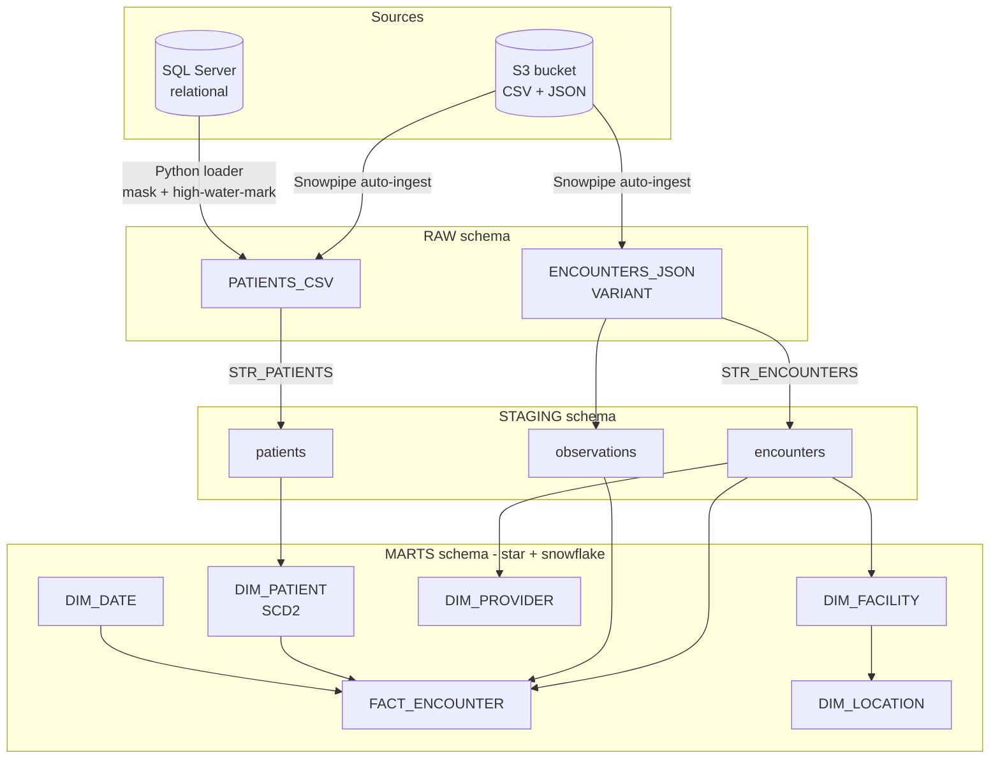

# Technical design

## Architecture

Change flows on **Streams**; the **Task DAG** (root + dependents, `PIPELINE_WH`, 1-minute
schedule, stream-gated) moves data STAGING → MARTS. `BI` reads `MARTS`.

## Data flow

1. **Ingest.** Files → Snowpipe `COPY` → RAW (JSON as VARIANT). Relational → Python loader
   (`fetch_batches` → `mask_row` → `INSERT`), incremental by high-water-mark.
2. **Capture.** APPEND_ONLY streams on both RAW tables expose new rows.
3. **Stage.** Streams consumed into typed/flattened STAGING (encounters flattened via
   `LATERAL FLATTEN`; the delta buffered in `STAGING.ENCOUNTERS_DELTA` so two tasks can read
   it).
4. **Model.** Dimensions built by `MERGE`; `DIM_PATIENT` by SCD2 expire-then-insert; the fact
   by `MERGE` with an SCD2-aware patient join.
5. **Serve.** BI queries MARTS.

## RBAC

| Object | Owner / grant |
|---|---|
| `PIPELINE_ROLE` | custom functional role, parented under `SYSADMIN` |
| `PIPELINE_WH`, `HEALTH_ANALYTICS`, schemas | owned by `PIPELINE_ROLE` |
| `EXECUTE TASK`, `EXECUTE MANAGED TASK` | granted on account to `PIPELINE_ROLE` |
| Credentials | `~/.snowflake/connections.toml` / `~/.snowsql/config` — never in repo |

## Key decisions & tradeoffs

- **Snowflake-native orchestration (Streams + Tasks), not Airflow.** The JD names Streams/
  Tasks; no external scheduler needed. Tradeoff: task DAGs are less expressive than Airflow,
  fine at this scope.
- **Backfill + streams, not streams-only.** Streams only see change since creation, so a
  one-time `INSERT OVERWRITE`/`MERGE` backfill seeds history; tasks keep it current. Cleaner
  than trying to replay history through streams.
- **Warehouse-backed tasks, not serverless.** Only needs `EXECUTE TASK`, reuses the XSMALL
  warehouse, cheaper on a trial. (`EXECUTE MANAGED TASK` also granted for flexibility.)
- **One deploy tool: connector-based `run_sql.py`.** Cross-platform (Windows + Linux), no
  SnowSQL install, and it substitutes `&{var}` placeholders and handles stored-procedure
  bodies. A second SnowSQL/bash path was removed to avoid two orchestration surfaces drifting.
- **Ordering-based pruning demo, not Automatic Clustering.** Deterministic and edition-
  independent; the production equivalent (`CLUSTER BY`) is documented.
- **File source for the loader in addition to SQL Server.** Enables offline dry-run + live
  testing before a DB exists; swapping to SQL Server is a config change.

## Known gaps

- **S3 Snowpipe auto-ingest** is built and documented but unverified (needs an AWS bucket +
  IAM). The `COPY`/VARIANT half is verified live via an internal stage.
- **Snowpark wall-clock** win needs a larger fact table to show (data-movement win is proven).
- SQL Server source itself is untested against a real instance (the load/mask/incremental
  logic is proven via the file source).
